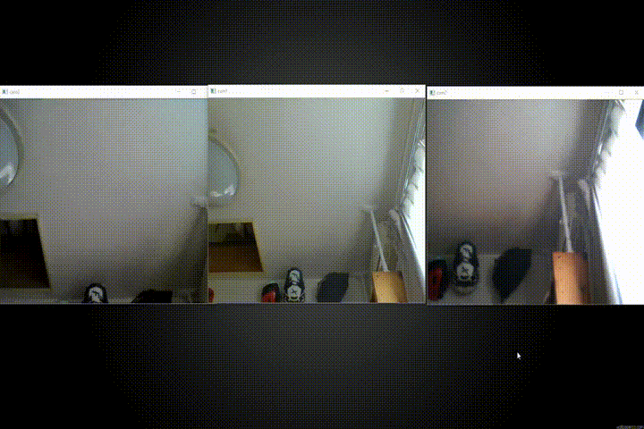

# Person / Face Detection and Re-identification Demo
This is a demo program to demonstrate how person or face detection DL model and re-identification model works with [**Intel(r) Distribution of OpenVINO(tm) toolkit**](https://software.intel.com/en-us/openvino-toolkit).  
This program finds the objects such as person or face from the multiple images, then assign ID and match objects in the pictures.
The demo program suppors multiple camera or movie file inputs (the program should work with more than 2 inputs).  
The re-identification model takes a cropped image of the object and generates a feature vector which consists of 256 FP values. This program calculates the cosine distance of those feature vectores of the objects to check the object similarity.  
The found objects are registered to a database with the created time. The time in the record will be updated everytime the record is used so that the program can check the elapsed time from the last use. The record will be evicted when the specified time passes.  

[**Intel(r) Distribution of OpenVINO(tm) toolkit**](https://software.intel.com/en-us/openvino-toolkit)を使った人・顔検出＋マッチングデモプログラムです。  
人検出、顔検出ディープラーニングモデルを使用して複数の画像から検出したオブジェクトに、re-identificationモデルを使用してマッチング、ID振りを行っています。  
2つ以上のカメラ、あるいはムービーをサポートすることも可能です。  
Re-identificationモデルは切り出されたオブジェクトのイメージから256個のFP数値からなる特徴ベクトルを生成します。このプログラムでは生成されたベクトル同士のコサイン距離の比較によってオブジェクトの類似度を判定しています。  
見つかったオブジェクトは時刻とともにデータベースに記録されます。レコードの時刻はそのレコードが使用されるたびに更新され、最後に使用された時刻がわかるようになっています。使用されないまま指定された時間が経過したレコードはデータベースから除外されます。

  

**You can track people in the images sent from multiple cameras**


### Required DL Models to Run This Demo

The demo expects the following models in the Intermediate Representation (IR) format:

 * For person / pedestrian detection and re-identification
   * `pedestrian-detection-adas-0002`
   * `person-reidentification-retail-0079`

 * For face detection and re-identification 
   * `face-detection-adas-0001`
   * `face-reidentification-retail-0095`

You can download those models from OpenVINO [Open Model Zoo](https://github.com/opencv/open_model_zoo).
In the `models.lst` is the list of appropriate models for this demo that can be obtained via `Model downloader`.
Please see more information about `Model downloader` [here](../../../tools/downloader/README.md).

## How to Run

(Assuming you have successfully installed and setup OpenVINO 2020.2. If you haven't, go to the OpenVINO web page and follow the [*Get Started*](https://software.intel.com/en-us/openvino-toolkit/documentation/get-started) guide to do it.)  

### 1. Install dependencies  
The demo depends on:
- `opencv-python`
- `numpy`
- `scipy`
- `munkres` (for Hangarian combinational optimization method)

To install all the required Python modules you can use:

``` sh
(Linux) pip3 install -r requirements.txt
(Win10) pip install -r requirements.txt
```

### 2. Download DL models from OMZ
Use `Model Downloader` to download the required models.
``` sh
(Linux) python3 $INTEL_OPENVINO_DIR/deployment_tools/tools/model_downloader/downloader.py --list models.lst
(Win10) python "%INTEL_OPENVINO_DIR%\deployment_tools\tools\model_downloader\downloader.py" --list models.lst
```

### 3. Run the demo app
This program doesn't take any command line arguments. All file names and paths are hard coded in the source code.
``` sh
(Linux) python3 person-detect-reid.py
(Win10) python person-detect-reid.py
```

In default, the program assumes that 2 USB webCams are attached to your PC. If you want to use movie files instead, modify the source code (it's easy :-) )


## Demo Output  
The application draws the boundinx boxes and ID numbers on the images.  

## Tested Environment  
- Windows 10 x64 1909 and Ubuntu 18.04 LTS  
- Intel(r) Distribution of OpenVINO(tm) toolkit 2020.2  
- Python 3.6.5 x64  

## See Also  
* [Using Open Model Zoo demos](../../README.md)  
* [Model Optimizer](https://docs.openvinotoolkit.org/latest/_docs_MO_DG_Deep_Learning_Model_Optimizer_DevGuide.html)  
* [Model Downloader](../../../tools/downloader/README.md)  
